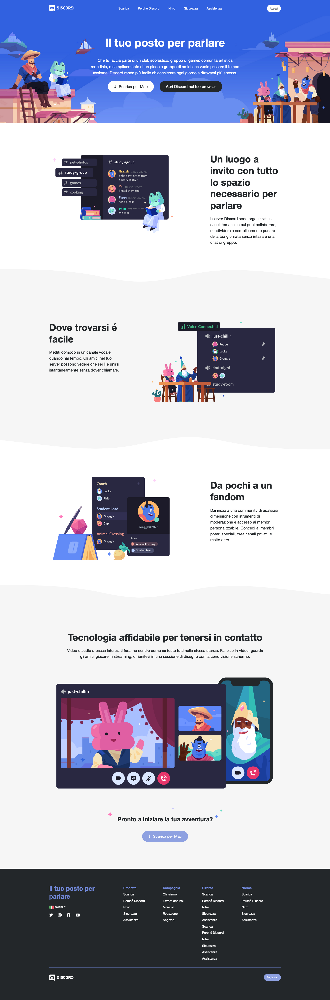

# Esercizio: "htmlcss-struttura-discord"
Riproduco l'home-page di Discord
---
Per riprodurre il layout utilizzo le proprietà di **Flexbox**.

Divido l'esercizio in due giorni:
- Primo giorno: realizzo la struttura base del sito utilizzando solo blocchi colorati, senza inserire ancora testi, img o dettagli.
- Secondo giorno: passo al dettaglio sezione per sezione. Creo delle classi riutilizzabili individuando gli elementi ricorrenti nel layout, capisco cosa posso centralizzare per rendere il codice il più possibile semplice, pulito e quindi mantenibile.
---
## Layout da riprodurre 

